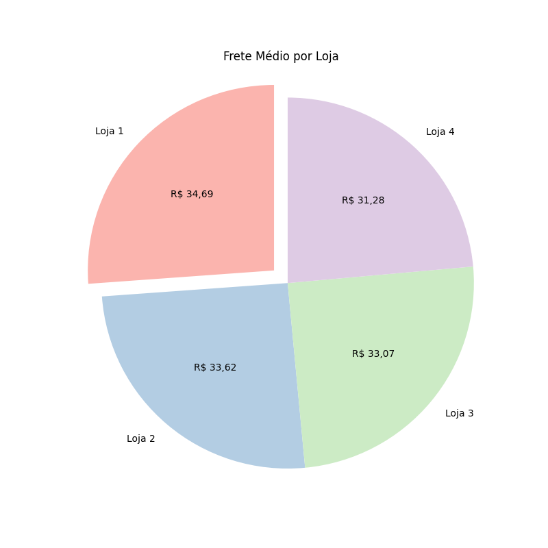
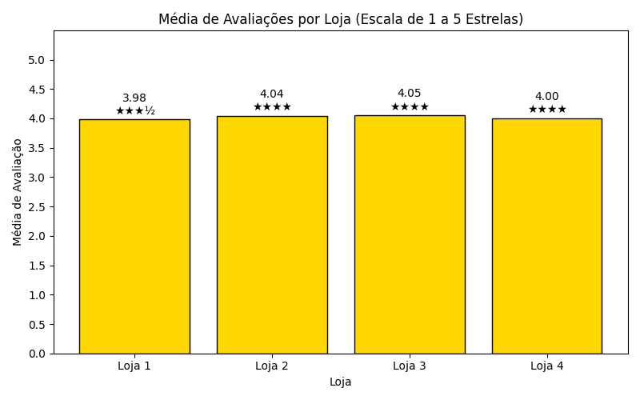

# 🏪 Challenge ONE Data Science: Alura Store – Qual Loja Vender?

[](https://www.python.org/)
[](https://jupyter.org/)
[](https://colab.research.google.com/github/rodrigosergiosilva/challenge-alura-store/blob/main/AluraStoreBr.ipynb)
[]()
[](LICENSE)

Seja bem-vindo ao primeiro desafio da Alura! 

Este projeto tem como objetivo auxiliar o Senhor João, proprietário da rede **Alura Store**, a decidir **qual das suas 4 lojas fictícias deve ser vendida** para que ele possa investir em um novo empreendimento.

---

## 🎯 Propósito da Análise

A análise foi realizada para identificar **a loja com menor eficiência**, utilizando dados reais simulados. Os principais pontos avaliados foram:

- Faturamento total de cada loja
- Vendas por categoria 
- Avaliações dos clientes  
- Valor médio de frete  
- Produtos mais e menos vendidos de cada loja

A conclusão é apresentada com base em evidências visuais e numéricas, utilizando ferramentas da ciência de dados.

---

## 🗂 Estrutura do Projeto

```
📁 challenge-alura-store/
│
├── 📄 AluraStoreBr.ipynb         # Notebook principal com toda a análise
├── 📄 README.md                  # Este arquivo
├── 📄 LICENSE
├── 📁 dados/                     # Arquivos CSV com dados das lojas
│   ├── loja1.csv
│   ├── loja2.csv
│   ├── loja3.csv
│   └── loja4.csv
├── 📁 imagens/                   # Gráficos gerados durante a análise
│   ├── faturamento_lojas.png
│   ├── frete_medio_loja.png
│   └── media_avaliacao_lojas.png
```
---

## 📊 Exemplos de Gráficos e Insights

Durante a análise, foram criadas diversas visualizações. Aqui estão alguns exemplos:

### 💰 Faturamento Total por Loja


- A **Loja 1** apresentou o maior faturamento, enquanto a **Loja 4** apresentou o menor faturamento entre todas.

### 🛍️ Frete Médio por Loja



- A **Loja 1** apresenta o maior frete médio, enquanto que a **Loja 4** apresenta o menor frete médio.

### ⭐ Avaliação Média por Loja



- Todas as lojas apresentam uma boa média de avaliação, acima de 3.9, com a **Loja 3** tendo a avaliação mais alta.

---

## ✅ Conclusão

Com base nas análises de desempenho, a recomendação é que o Senhor João **venda a Loja 4**.  
Ela apresentou **baixo faturamento, menor frete médio e menor desempenho geral** quando comparada às demais unidades.

---

## 🚀 Como Executar o Notebook

1. Tenha o **Python 3.10 ou superior** instalado.
2. (Opcional) Crie um ambiente virtual:
   ```bash
   python -m venv venv
   source venv/bin/activate  # No Windows: venv\Scripts\activate
   ```
3. Instale as dependências:
   ```bash
   pip install pandas matplotlib jupyter
   ```
4. Clone este repositório:
   ```bash
   git clone https://github.com/rodrigosergiosilva/challenge-alura-store.git
   cd challenge-alura-store
   ```
5. Execute o Jupyter Notebook:
   ```bash
   jupyter notebook AluraStoreBr.ipynb
   ```

Ou acesse diretamente no Google Colab:  
[](https://colab.research.google.com/github/rodrigosergiosilva/challenge-alura-store/blob/main/AluraStoreBr.ipynb)

---
## 📄 Licença

Este projeto está licenciado sob os termos da [](LICENSE).  
Sinta-se livre para usar, modificar e distribuir com os devidos créditos.

---

## 📬 Contato

[](https://www.linkedin.com/in/rodrigo-sergio-silva/)

Fique à vontade para abrir uma **issue** ou enviar uma **pull request** com sugestões ou melhorias! 😄

